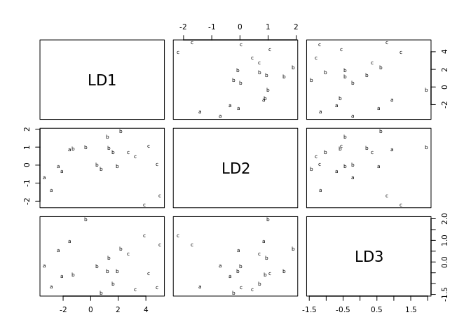

<!-- README.md is generated from README.Rmd. Please edit that file -->

# Discriminant-Analysis-k-Nearest-Neighbors

The head of the zone of a banking entity has five offices under his
command.

The type variable indicates the group in which each individual is
classified: a-office manager, b-commercial managers, c-controllers.

The rest of the variables are the sales in the last month of each of
these workers under his command are in: sales of life insurance, sales
of payroll accounts, sales of virtual cards and sales of credit cards.
He wanted to know if the individuals are well classified in their
position (director -a-, manager -b- or controller -c-) based on their
sales or should we change someone, promoting or demoting them.

We will classify individuals according to the k=3 nearest neighbors
method and the k=3 nearest neighbors method with cross validation.

## 1. k=3 nearest neighbors method

    #>       insurance accounts virtual credits
    #>  [1,]         2        2       3       3
    #>  [2,]         3        2       3       3
    #>  [3,]         3        3       4       3
    #>  [4,]         2        3       4       4
    #>  [5,]         4        3       3       3
    #>  [6,]         4        5       4       3
    #>  [7,]         6        6       5       5
    #>  [8,]         5        5       5       5
    #>  [9,]         6        7       6       5
    #> [10,]         6        6       6       6
    #> [11,]         7        7       5       5
    #> [12,]         6        8       5       5
    #> [13,]         5        6       6       5
    #> [14,]         5        3       3       4
    #> [15,]         7        9       7       7
    #> [16,]         8        9       7       7
    #> [17,]         7        5       6       5
    #> [18,]         8        9       8       8
    #> [19,]         8        2       8       7
    #> [20,]         7        2       7       8
    #> Call:
    #> lda(datos, grouping = tipo)
    #> 
    #> Prior probabilities of groups:
    #>    a    a    b    c 
    #> 0.05 0.20 0.45 0.30 
    #> 
    #> Group means:
    #>    insurance accounts  virtual  credits
    #>  a  3.000000 2.000000 3.000000 3.000000
    #> a   2.750000 2.750000 3.500000 3.250000
    #> b   5.555556 5.888889 5.000000 4.777778
    #> c   7.500000 6.000000 7.166667 7.000000
    #> 
    #> Coefficients of linear discriminants:
    #>                   LD1        LD2        LD3
    #> insurance  0.94000726  0.6156730  0.7390125
    #> accounts  -0.06336958  0.3121436 -0.3205886
    #> virtual    0.36936009 -0.5698803 -0.9040326
    #> credits    0.21668202 -0.4615104  0.2679291
    #> 
    #> Proportion of trace:
    #>    LD1    LD2    LD3 
    #> 0.9484 0.0471 0.0045
    #>                   LD1        LD2        LD3
    #> insurance  0.94000726  0.6156730  0.7390125
    #> accounts  -0.06336958  0.3121436 -0.3205886
    #> virtual    0.36936009 -0.5698803 -0.9040326
    #> credits    0.21668202 -0.4615104  0.2679291

<!-- -->

    #>  [1] a a a a a a b b b b b b b b c c c c c c
    #> Levels:  a a b c
    #> [1] 0.1

## 2. k=3 nearest neighbors method with cross validation

    #>  [1]  a   <NA> b    a    b    b    c    b    c    c    c    c    b    b    d   
    #> [16] c    c    d    d    d   
    #> Levels:  a a b c d
    #> [1] NA
    #>  [1] a a b a b b b b b b b c b c d d b d d d
    #> Levels:  a a b c d
    #> [1] 0.35
    #>  [1]  a a  b  a  c  b  b  b  c  b  b  b  b  b  d  c  b  b  d  d 
    #> Levels:  a a b c d
    #> [1] 0.7
    #>  [1]  a   <NA> b    a    b    b    c    b    c    c    c    c    b    b    d   
    #> [16] c    c    d    d    d   
    #> Levels:  a a b c d
    #> [1] NA
    #>  [1] a  a  b  a  c  b  b  b  b  b  b  c  b   a d  d  b  d  d  d 
    #> Levels:  a a b c d
    #> [1] 0.45
    #>  [1] b a b a a b b b c b b b b b d c b b d d
    #> Levels:  a a b c d
    #> [1] 0.7

By performing the k=3 nearest neighbors method and the k=3 nearest
neighbors method with cross validation. The results indicate that there
are more elements misclassified and that the error rate increases, so
this result would not be very significant, and that it could probably be
classified into 4 groups according to the results of the validations.
